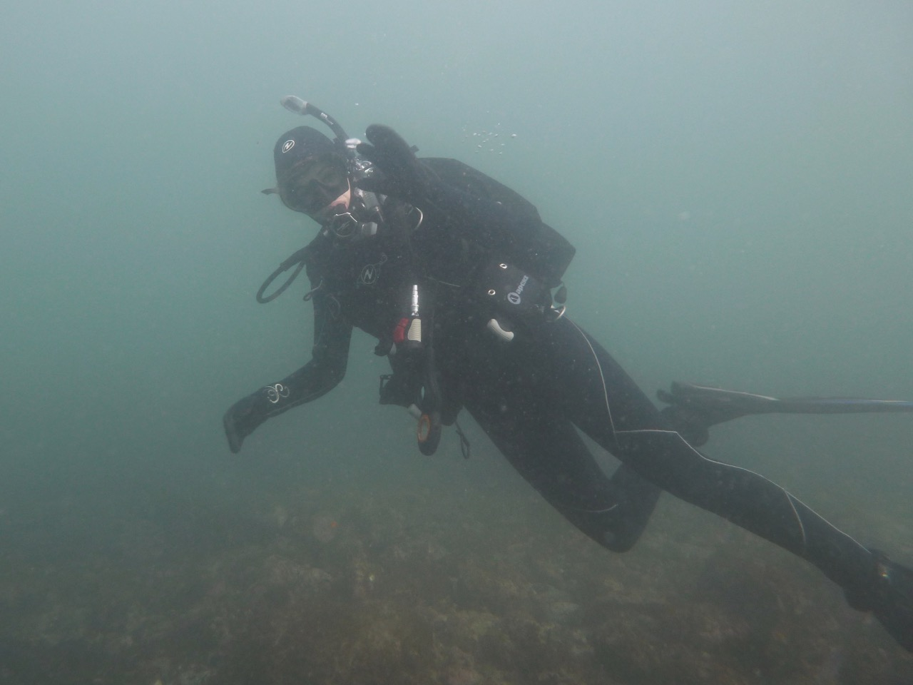
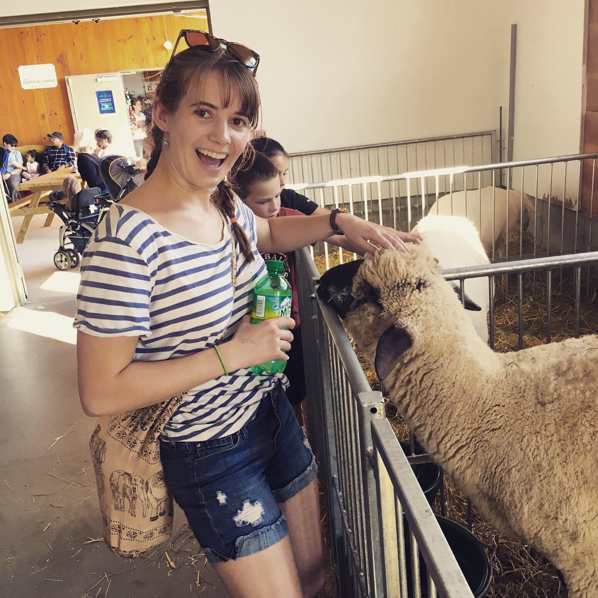

## Home Page

Kaitlin was originally born and raised in Los Angeles, California. She grew up going to the beach and local aquariums, which sparked her interest in Marine Biology. She attended Gonzaga University in Washington State to obtain her Bachelors degree. She lucked into a lab opportunity with Dr. Julie Beckstead, studying the invasive prairie grass, cheatgrass. This grass is invasive in large areas on the West Coast and out competes native grasses to form dense monocultures. Cheatgrass emerges earlier than native grasses, is inedbile to cattle, and has altered the fire regimes in the West. Kaitlin was trying to develop a native fungal pathogen as a potential biocontrol, and spent much of her time encouraging fungus to mate sexually. Additionally, she investigated the effect of the herbicide Imazapic on emergence of native and invasive prairie grasses. She found that Imazapic was persistent in the soil several years after application, and had negative effects on the emergence of native grasses, contrary to what had been thought previously. 

She then attended the University of New Hampshire for her Master's Degree and is currently working towards her Ph.D.